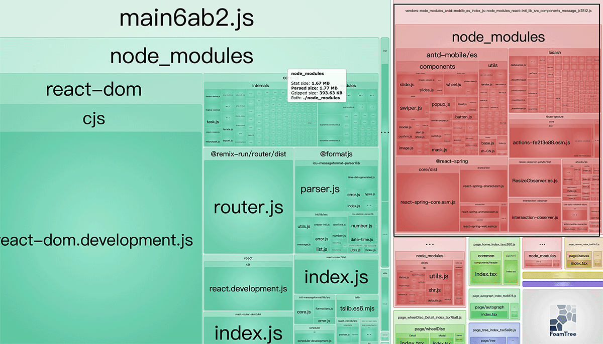

[![node][node]][node-url]

# start
> npm install

> npm run dev

> npm run build

> npm run build-analyze

# routes
├─page                   # 活动页面  
│  ├─autograph           # 签名  
│  ├─clock               # 时钟  
│  ├─home                # 主页面  
│  ├─task                # 录屏测试  
│  ├─test                # 测试功能  
│  ├─tree                # 树组件（适用于pc端）  
│  ├─wheelDisc           # 转盘抽奖  
│  └─routesConfig        # 路由配置  
├─public                 # 静态资源  
├─dps.config.js          # 骨架配置  

# notice
1. 除了 './common/style' 下的样式文件和所有的.css文件均会被tree-shaking;
2. 生产环境css的sourceMap生成取决于devtool选项
3. 打包后如有报错（Uncaught ReferenceError: $RefreshSig$ is not defined）删除configcache文件后重试
4. <b>node version: 14</b>

# aim

# feature
1. react-router v6 ｜ react18 ｜ webpack v5
2. 基于路由的动态导入
3. react-refresh
4. 友好的换肤功能
5. tree shaking
6. i18n
7. 基于suspense的skeleton（前端方案） 
为了尽量减少白屏时间，入口js需要尽量的小，此方案依赖于react运行时、react-router所以将这两个依赖和入口文件放在一个包中，此包加载完毕即可看见骨架屏（这两个依赖比较固定，入口文件需要频繁修改的话，可以把他们分开，依赖浏览器缓存、gzip等技术白屏到骨架屏的时间会很小）。等待其他资源加载完成，react会自动切换页面替换掉骨架屏。

# babel配置对应打包体积
babel配置|size
---|:--:
esmodules,不引入regenerator-runtime|1361
未esmodules,引入regenerator-runtime|1387
esmodules,引入regenerator-runtime|1302
esmodules,不引入regenerator-runtime|1276

# tree shaking

> -: 未配置

modules|usedExports|sideEffects|生产|测试
---|:--:|:--:|:--:|---:
commonjs|true|false|❌|❌
commonjs|-|false|❌|❌
false|true|false|✔|✔
false|-|false|✔|❌
false|true|-|✔|✔

# babel-loader/ts-loader

loader|es6-es5|class|类装饰器|api
---|:--:|:--:|:--:|---:
babel|preset-env|preset-env||plugin
ts|target:es5|target:es5|✔|❌

[node]: https://img.shields.io/badge/node-14-blue
[node-url]: https://nodejs.org
